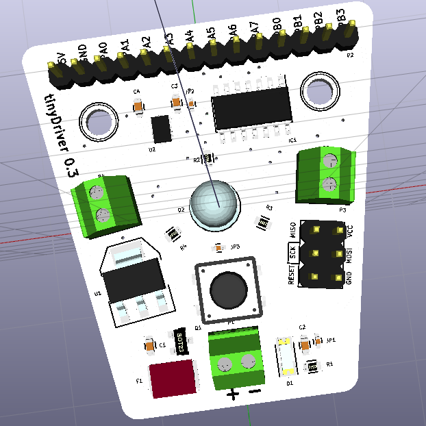

## Applications of tinyDriver

- tinyAVR course
- 2WD robot
- Laser Display (rotating mirrors)
- Mechanical Iris
- Drum machine - 2 X solenoids
- DDS (direct digital synthesis)
- Music synthesizer
- Karplus strong project
- Arduino IDE support - bootloader?
- music robot - look at: 
  https://www.crowdsupply.com/vivek-mano/wigl
- expression robot - look at: http://ohbot.weebly.com/
- serial protocol - control (motors) via python from computer
- pentatonic laser harp
- musical synth
- SD card music player
- The whistle blower
- POV toy
- footstep detector
- hovercraft?
