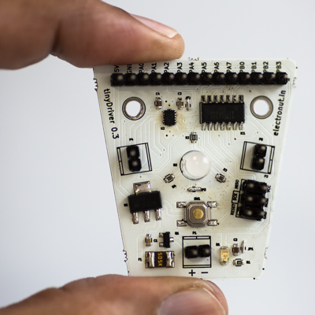

*tinyDriver* is a breakout board for the Atmel ATtiny84 chip, which
comes integrated with a motor driver chip and an RGB LED. The idea was
to create a convenient platform that can be used to understand
microcontrollers in depth, by studying the datasheet and making use of
the various features of the chip such as timers, PWM, interrupts, ADC,
and digital I/O. The free and cross-platform avr-gcc and avrdude
toolchain combined with cheap USB based AVR programmers makes it very
easy to develop projects for this board. You can use
tinyDriver as a convenient platform to learn about tinyAVRs and
prototype your projects.

[http://electronut.in/tinyDriver/][1]

[1]: http://electronut.in/tinyDriver/
